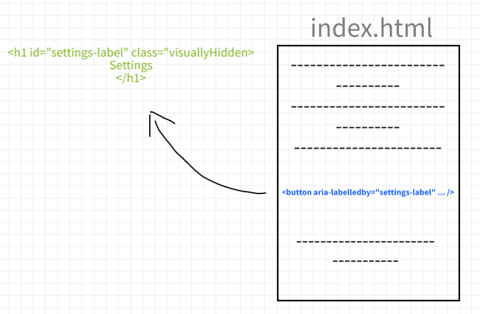

# Intro
This document contains all the different information about HTML, communication, storage, prod vs dev and other topics with relation to web development.

# HTML

## Sessions and Cookies
(todo - fact proof)
Let's assume that our server uses cookies to identify users. Process goes like this:

1. User requests a service
2. Server receives the request:
   1. Creates a cookie for the user (because incoming request didn't contain any cookie yet):
      - request.session.(anything) = (received + created information we need to store in cookie)
   2. Server stores this received session inside a database (for example redis for fast communication)
      - redis returns a key: **session**:*fiuqb4gpiuqb2i4jtb*
   3. Server encrypts the cookie using its secret key.
      - encrypted = key X serverSecret
   4. Then it replies to the client with a Set-Cookie header with this new cookie.
     - Set-cookie: encrypted
   5. Client browser stores this cookie. 
3. Client later requests another service, but since it already has the cookie, browser will attach it to the request.
4. Server will take the cookie, decrypt it using its secret and make a request to the database for the cookie information.

## Window
It is easily possible to access the document via the [window object](https://developer.mozilla.org/en-US/docs/Web/API/Window). `window` is an interface containing the whole DOM where the `window.document` property points to the DOM itself while other useful properties are also available for us (like `window.location`, which is basically the URL).

### [Location](https://developer.mozilla.org/en-US/docs/Web/API/Location)
We can use and refer to the parts of the URL as read-only string via the `location` property. Location provides us with:

   - hash
   - host
   - hostname
   - href
   - origin
   - pathname
   - port
   - protocol
   - search

# Accessibility
Most known by the ARIA shortcut (Accessible Rich Internet Applications) which is also used in programming and denotes accessibility feature or option (for example html attributes like `aria-label`). Makes it possible for everyone to use the web and applications with any device (from laptops to screen readers) and for users even with disabilities (blind, deaf, ...).

## Labelled elements
Labels in general describe an element textually. The said element may describe its purpose by something else, for example an image of keg for settings instead of the word "Settings", and make it therefore impossible to use if not applicable (screen reader wouldn't be able to parse such image into a text without any help).

### Aria-label
**Aria-label** enables the parsing of such unusual elements with the help of a descriptive text attached to that element. If an element has both `label` and `aria-label`, the aria variant will always be preferred and used.

- Emojis example
Closely related to aria-label topic are emojis in text. Screen readers may not be capable (not sure about how they manage emojis) of handling emojis. Therefore it is a good practice to wrap them in `<span>`, give them a `role="img"`, and have an accessible description with aria-label or aria-labelledby (see below).

Example: 
```html
<p>I love cats !<span role="img" aria-label="Paw Prints">🐾</span><p>
```

### Aria-labelledby
**aria-labelledby** is a pointer to another element's ID. Current element with an aria-labelledby refers to another element's ID. This "another element" should provide necessary description for the current element. It basically says "search for element with this ID and it says what I am".

Aria-labelledby can be used on _any_ element. It is possible for one element to have multiple aria-labelledby attributes which will get concatenated when necessary. **NOTE** that aria-labelledby overrides every other type of label (aria-label or traditional label).

Useful trick would be to create a [visually hidden element](#visuallyhidden-aka-making-the-web-accessible) and to point `aria-labelledby` towards it. In the illustration below we see an `index.html` page with a visually-hidden element outside of the main content of the page. Our 'settings' button points towards this visually-hidden element, since it describes the button as well and the button has no label or text associated to it.



## VisuallyHidden a.k.a. Making the Web accessible
When creating a web page we typically use HTML sections to divide page into separate parts (navigation, main content, sidebar, ...). These sections are usually divided using CSS - navigation is on top, has light blue background, black border on the bottom and fixed position with 100% width. We can clearly see that the design separates this section from other sections.

For a user with screen reader information about styling gets stripped of. The are only left with text which is read line by line so therefore we need to use a different technique that tells the user that they are reading information from different section of the application.

This is usually done by putting headings into the content of our sections. This can obviously [disrupt the original styling](https://www.accessibility-developer-guide.com/examples/headings/visually-hidden-headings/_examples/page-with-additional-page-regions-with-headings/_example.png) and add unnecessary noise for other users.

Therefore any additional content that describes the structure of the page or the related content should be [visually hidden](https://www.accessibility-developer-guide.com/examples/headings/visually-hidden-headings/) to not disturb users who don't need it and to provide essential help for those who do. Since styling is removed for screen-reader users we can write the CSS to move additional content visually out of the page:

```css
.visually-hidden {
  position: absolute;
  left: -10000px;
  width: 1px;
  height: 1px;
  overflow: hidden;
}
```

# Package Managers

## NPM and Yarn
NPM is traditional and works well. Yarn is similar, considered rather as an alternative instead of replacement[^1]. 

[^1]: At the time of Yarn release it had features which NPM didn't offer, making it an enhancement over NPM. Since then NPM introduced crucial updates proving our statement.

## pNPM
I discovered also pNPM which reminds me of Maven and POM from Java. It keeps local storage and points every installed package towards it so we don't have to download many copies of the same package.

# Project structure

## manifest.json
We differentiate between multiple types of manifest files.

### Browser extensions
Browser extension must contain `manifest.json` in case it is using [WebExtension API](https://developer.mozilla.org/en-US/docs/Mozilla/Add-ons/WebExtensions/manifest.json). It contains metadata about aforementioned extension's functionality such as background scripts, content scripts or browser actions.

### Web Application
In case of a [web app project](https://web.dev/add-manifest/) (also called Progressive WebApp Project, PWA in short) it provides information about application name, icons, themes and starting URL. It is not fully [supported in all browsers](https://developer.mozilla.org/en-US/docs/Web/Manifest#browser_compatibility).