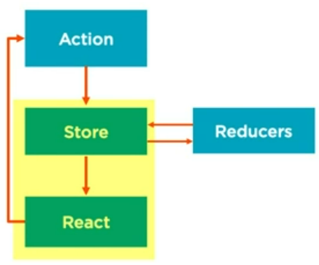

# About
React with Redux. Used most of the configuration from [webpack sample project](../react-typescript-webpack-project/). At first I was following [Building Applications with React 16 and Redux](https://app.pluralsight.com/library/courses/00454b2e-e8d2-43c1-9424-aa542d120404/table-of-contents) course on pluralsight but I later discovered that there is a more recent and modern approach using Redux Toolkit and [this tutorial](https://www.youtube.com/watch?v=bbkBuqC1rU4) helped me understand the usage of this awesome Redux Wrapper.

Dependencies:

- React
- Typescript
- Webpack & Babel
- Redux

# Presentation Components vs Containers
React isn't restricted to render every component in a 'visual' way. Many components can serve a grouping purpose and they don't visibly emit HTML themselves. There are a few key differences between containers and such 'presentation' components:

Container (also called *stateful* or *controller view*):
- usually holds state and functionality
- no visual elements or attributes
- can use Redux' `connect` to work with state

Presentational components (also called *view*):
- (usually simple) visual elements
- contain markup, styling, ...
- receive data to depict and handlers via props
- no state, ideally standalone not-dependant on non-visual elements

Container components should be considered when we are passing props down but are not working with them throughout[^1].

[^1]: This is also a place to consider context.

# Redux
Redux works with only a single store - single source of truth. It stores immutable data and allows the user to handle this data using reducers and actions.

Immutability has these benefits:
- Performance: Determining change is easier, because we can compare two object **references** and not every value of both objects.
- History: We are able to store multiple versions of a single object on each change and therefore able to re-create previous states. Tools allow us to reproduce steps that led to the current state and review each change.


Disadvantage is that we have to enforce these rules within the project team. We need to ensure that we don't forget and accidentally manipulate the data but rather use a reducer to perform an action. There are also tools that warn about manipulating with immutable variable like `redux-immutable-state-invariant` (use only in development !). Lastly, we can enforce library usages that handle immutability for us and provide us with ways of (seemingly changing immutable data). Those are packages like `immer`, `immutableJS`, etc.

## Manipulating the Store
In this section we will see Redux fundamentals.

### Store
Single source of truth with immutable data. There is no access to the store itself (for good reasons). The functions available to us are:

- dispatch (use reducer to somehow "change" the data)
- subscribe
- getState
- replaceReducer (useful for updates for hot replacement)

### Action
Action is a simple object  that represents an intent. It has (almost) arbitrary structure - only required to contain a `type`. It is a good practice to implement action creators as function that handle the action initializations so we don't have to keep track of the defaults.

```js
// operation is a supplied callback
function taxAction(taxAmount) {
  return {
    type: "TAX",
    taxAmount: taxAmount
  }
}
```

### Reducers
For the manipulation of the store we need to use a reducer with an action. The reducer is a *pure* function that returns new state. Ensure that a reducer produces no side-effects and for the same input reducer always returns the same output. It is forbidden to:

- mutate arguments
- perform side effects
- call non-pure functions

Basic structure of a reducer can look like this:

```js
function someReducer(state, action) {
  // ...
  return newState;
}
```

Below we can see a sample implementation of the reducer. Notice that we first determine the type of action and then act accordingly by creating a new object:

```js
function someReducer(state, action) {
  switch(action.type) {
    case 'TAX':
      return { state.total * (1 + action.taxAmount) };   // ex. 5 * 1.4 (0.4 taxAmount)
    default:
      return state;
  }
}
```

This would be even easier in typescript, because we can overload functions and thus create multiple reducers with the same name that correspond to each action separately:

```ts
type Action = { type: string };
type SomeAction = { value: number } & Action;
type OtherAction = { param: string } & Action;

function reducer(state: any, action: SomeAction) {
  // handle SomeAction
}

function reducer(state: any, action: OtherAction) {
  // handle OtherAction
}
```

But [as it turns out](#redux-toolkit) it has been done already in a more cleaner way.

It is possible (and even recommended) that a reducer uses multiple other reducers to handle one action. This is called `reducer composition` - using multiple specific reducers for performing small pieces of updates where necessary.

Complete example of action and reducer:

```ts
// couseActions.ts
import type { Course } from '../../types';
import { ActionType, CourseAction } from '../types/index';

export const createCourse = (course: Course): CourseAction => {
  return {
    type: ActionType.ADD_COURSE,
    course
  };
};

// courseReducer.ts
import { ActionType, CourseAction, ReduxState } from "../types/index.d";

export const courseReducer = (state: ReduxState, action: CourseAction) => {
  switch (action.type) {
    case ActionType.ADD_COURSE:
      return [
        ...state.courses,
        action.course
      ];
    default:
      return state.courses;
  }
};
```

## Redux Flow - Middleware
Redux works in this order when it comes to its lifecycle:

- Action triggers Reducer
- All of the middleware gets run
- Reducer performs an action
- Redux triggers re-render of all components relying on that action

We've already inspected actions and reducers. We will take a look at the middleware now. These are functions that can affect the data in the Redux' execution flow. We can write any custom middleware but chances are commonly used middleware was already written. The usual structure of a middleware can utilize curried function[^2]:

```js
// utilized function chaining
const logger = (store) => (next) => (action) => {
  console.group(action.type);
  console.info('dispatching', action);
  const result = next(action);
  console.log('next state', store.getState());
  console.groupEnd();
  return result;
}
```

[^2]: Currying is a process of chaining operations and refers to a mathematical term.

## Creating and configuring the store
Configuration includes a little bit of boilerplate code but once set, it can be left untouched for a long time. The power of Redux comes with increased project complexity. Configuration of the store includes the following general steps:

- creating store
- attaching reducers
- attaching required middleware

First step is to bundle all of our reducers together. We can use a handy utility for that called `combineReducers` which takes object of all reducers as parameter and returns one single reducer.

```ts
// index.ts
import { combineReducers } from 'redux';
import { courseReducer } from './courseReducers';

const rootReducer = combineReducers({
  course: courseReducer
});

export default rootReducer;
```

This allows us to simply define our actions and reducers and let the `combineReducers` create a wrapper that we use to create the store:

```ts
// createReduxStore.ts
import { configureStore } from '@reduxjs/toolkit';
import rootReducer from './reducers/index';

export const store = createReduxStore () {
  return configureStore({
    reducer: rootReducer
  });
}
```

When we're finished, last thing to set up is to wrap usually the entire application in a Redux `Provider` that will serve the store to all the components.

```tsx
// index.tsx

import { Provider as ReduxProvider } from "react-redux";

// ... react initialization

const store = createReduxStore();

const root = createRoot(document.getElementById('root')!);
root.render(
  <ReduxProvider store={store} >
    <App />
  </ReduxProvider>
);
```

## Connecting React Components to Redux
As described earlier, we will use containers to connect to the redux. In the figure below we can see how React and Redux work together:



Yellow-highlighted area corresponds to Redux' responsibilities - it keeps and manages the store and updates relevant components when the respective store content changes. **It is important to remember** that Redux isn't exclusive to React. It can be used by other frontend frameworks too. In order to work with Redux in React we need to use `react-redux` library.

After adding necessary dependencies, we can `connect` our component to Redux, but before that. let's look at the connect function and describe its parameters:

`connect(mapStateToProps, mapDispatchToProps)(MyComponent)`

### mapStateToProps
Parameter `mapStateToProps` describes what state we want to pass to our component. It questions on what part of the redux store do we want to expose on the component. It is a function that returns an object that will be mapped onto our props. We can also say that this function transforms the store onto a specific components. We must be careful though because every time that a state changes, the component re-renders. Therefore being as specific as possible is a must.

One more important consideration is that whenever the component changes, this `mapStateToProps` function is called. Memoization is in this case a useful technique for determining if we actually need to re-run this function, since it can contain complex computations. Memoization can be achieved with React itself (useMemo) or any suitable libraries like `reselect`.

```js
function mapStateToProps(state) {
  return {
    users: state.users    // this will be a prop on our component
  }
}
```

### mapDispatchToProps
The next parameter `mapDispatchToProps` specifies what actions we want to expose as props. It is similar to `mapStateToProps` but receives `dispatch` as parameter. There are multiple ways we can use this function:

1. `bindActionCreators()`: This Redux function uses the third approach from this list but performs it automatically. Only requirement is to pass set of actions we need to wrap.
```js
function mapDispatchToProps(dispatch) {
  return {

    // sample usage: props.actions.loadCourses()
    actions: bindActionCreators(actions, dispatch);
  }
}
```
2. Ignore it completely: The `mapDispatchToProps` is only an optional parameter. By default, component will receive a `dispatch` functions that still allows the component to call specific actions manually if needed. It's not really beneficial, since we enable the component (which will only be a *view component*) to use Redux which it shouldn't even know about.
3. Manually wrapping actions: Implementing the `mapDispatchToProps` and returning an object with function calls as 'state-grabbers' is a nice solution:
```js
function mapDispatchToProps(dispatch) {
  return {
    // accessible via props.loadCourses or props.createCourse
    loadCourses: () => { dispatch(loadCourses()); },
    createCourse: () => { dispatch(createCourse(course)); };
  }
}
```
4. Define `mapDispatchToProps` as object with keys of actions we need and Redux will manage the mapping behind the scenes.
```js
const mapDispatchToProps = {
  loadCourses,
  incrementCounter
}
```

## Asynchronous Execution
There are popular libraries that enable the use of asynchronous operations in Redux:

- redux-saga (popular, hard to learn, robust)
- redux-thunk (popular, easy to learn, small in size)
- redux-promise (uses, obviously, promises)
- redux-observable (RxJS observables)

In this example we will use redux-thunk, since it is easy to use and already available with tools like Redux Toolkit. If not, we would simply need to install it and add it to the list of middleware when creating the store. 

Now Redux needs an action and a reducer. Our async function should now return a function that will later asynchronously receive `dispatch` and use it to create an action:

```ts
// courseAction.ts
export const loadCourses = () => {
  return (dispatch: Dispatch) => {

    // use our API service to obtain the courses
    // and handle the returned promise from it
    return api.loadCourses()
      .then((courses: Course[]) => {
        dispatch(loadCoursesSuccess(courses));
      })
      .catch((error: Error) => {
        throw error;
      });
  };
};
```

Our reducer now obtains the loaded courses and can act accordingly:

```ts
export const courseReducer = (state: ReduxState = { courses: [] }, action: CourseAction) => {
  switch (action.type) {
    case ActionType.ADD_COURSE:
      return [
        ...state.courses,
        action.course
      ];
  
    // replace courses with the newly loaded ones
    case ActionType.LOAD_COURSES_SUCCESS:
      return action.courses;
  
    default:
      return state.courses;
  }
};
```


# Redux Toolkit (RTK)
Following the tutorial I discovered that modern Redux uses [Redux Toolkit](https://redux-toolkit.js.org/introduction/getting-started#an-existing-app) instead of direct raw initialization for a simpler and more robust approach. It covers and automates many things that we would normally manually write and maintain. Some notable included libraries are:

- redux
- immer
- redux-thunk
- reselect

There are (for now) two peer dependencies required:

- react
- react-redux: Implementation of a React 'driver' for Redux, since Redux is not specific to React.


There are subtle differences in how Redux Toolkit approaches some features of Redux. One important difference is the availability of a thing called `slice`. Redux lets us create state, define actions and implement them within reducers. Slices, on the other hand, do this all in one for a specific area of our application. A slice has this typical structure:

```js
export const counterSlice = createSlice({
  name: "counter",
  initialState: {
    value: 0
  },
  reducers: {
    increment: (state) => {
      state.value =+ 1;
    },
    decrement: (state) => {
      state.value -= 1;
    },
    incrementByAmount: (state, action) => {
      state.value += action.payload;
    }
  }
});

export const { increment, decrement, incrementByAmount } = counterSlice.actions;
export default counterSlice.reducer;
```

There is a lot to cover, so let's dive into it.

A slice has it's own store definition. This doesn't mean that each slice has it's own store but rather keeps store parts separated by concern. We can create the store with all reducers, actions and initial state but this way we only care about specific issue of our application.

Second **big difference** is that reducers in slices can **manipulate with the store directly**. Contrary to the traditional `make a copy and change it` philosophy of Redux, slices offer greater flexibility and allow us to make direct changes to the state. Behind the scenes, Redux Toolkit watches changes and if it detects one, it uses `immer` library to convert our direct change to an immutable variant.

Lastly we can see at the bottom `export` statement that Redux Toolkit knows about our actions. This is due to automatic actions generation based on our reducers. Redux Toolkit takes our reducers and creates the actions accordingly and we can use it if necessary.

Notice that in the last reducer `incrementByAmount` we are passing in an action but we never define one. Every action will have a `payload` which can be an object or a value if we need. We can later use this payload to access data passed in to the reducer like this:

```js
const { value } = useSelector((state) => state.counter);  // select the store section needed
const dispatch = useDispatch();

function incrementBy69() {
  // '69' will be passed as `action.payload`to the reducer
  dispatch(incrementByAmount(69));
}
```

Creating the store is now just a cake:

```js
import { configureStore } from '@reduxjs/toolkit';

export const store = configureStore({
  // just a demonstration
  reducer: { 
    user: userReducer,
    clients,
    // ... and possibly more
  }
})
```
After this, the only thing left is to wrap required part(s) of the application in a provider, which will have the initialized store available.

## Asynchronous functions in RTK
Async functions are even cleaner in RTK. We can use `createAsyncThunk` (assuming we are using the redux-thunk library) and we will have to:

- specify the unique name of this thunk
- supply an async function

The signature can be described like this: 

```ts
// note that this is only a general description, actual types are a bit more complex 😼
declare function createAsyncThunk(
  type: string,
  payloadCreator: (arg: ThunkArg, thunkAPI: GetThunkAPI<ThunkApiConfig>) 
  options: ThunkOptions
): AsyncThunk 
```

This function generates a thunk, let's focus on the parameters. `type` is for the action generation. We would want to set the `type` to know what actions should we expect. Because an async call can take some time, there are always 3 generated actions according to the supplied type:

```ts
createAsyncThunk(
  'session/getCurrentUser',
  async () { /* ... */ }
);
```

From this example the generated action types would be:

- pending: 'session/getCurrentUser/pending'
- fulfilled: 'session/getCurrentUser/fulfilled'
- rejected: 'session/getCurrentUser/rejected'
  
This enables us to react to the different states of the asynchronous request. Is it completed ? Show a success toast ! Is it loading ? Show a spinner ! Failed ? Show the reason ! We have flexibility over throughout the function execution within the application.

The `payloadCreator` is the logic we want to execute (like an API call). It should return a promise, but synchronous execution is also allowed. In case of an error it should return a promise containing an error or an error description through the `RejectWithValue` function (available from `thunkAPI`, see below). 

`payloadCreator` can have 2 arguments: 

- **arg**: A single argument that was passed to the thunk async function. This allows us to supply the execution with values from outside,
- **thunkAPI**: an object containing multiple handy functions and attributes that we might need to enrich the execution. This powerful parameter offers:
  - **dispatch**: Dispatch at our hands. We can dispatch anything from within our async function.
  - **getState**: Use any value in the store !
  - **extra**: Extra argument obtained from configuration, if available.
  - **requestId**: unique ID generated for this request operation.
  - **signal**: an object of type `AbortController.Signal` that can mark this request for cancellation.
  - **rejectWithValue**: Handy function allowing us to return with an error message like `rejectWithValue('something went wrong')`
  - fulfillWithValue: Again, handy function, this time for success message.

The `options` parameter can determine the requirements to run the `payloadCreator`:
- **condition**: If `false`, execution will not be run.
- **dispatchConditionRejection**: if `false`, no dispatch actions will be executed **at all**.
- **idGenerator**: generator for the `requestId`, defaults to [nanoid](https://redux-toolkit.js.org/api/other-exports/#nanoid)[^3].
- **serializeError**: custom error serialization logic.
- **getPendingMeta**: a function to create an object that will be merged into the `pendingAction.meta` field.


[^3]: `nanoid` generates non-cryptographically-secure random ID strings. It shouldn't be used when security is important.

## Major Gotcha's

### Naming Convention
When using a store inside a component we can use a `useSelector` hook which gives us requested part of the store. Usually examples showcase something like this:

```ts
const MyComponent: React.FC = () => {
  const { user } = useSelector((state) => state.session);   // what is this state ? 🧐
  // use 'user' from 'session' located in the store
}
```

But since we are accessing the store almost directly, it is more practical and clear to use the `store` keyword within the `useSelector` hook. Subtle change that can make quite a difference to someone not skilled enough with Redux:

```ts
const MyComponent: React.FC = () => {
  const { user } = useSelector((store) => store.session);   // oh, it's actually the store 😲
}
```

### Return statement in a Reducer
Be careful not to return anything from the reducer implementation in a slice. Why ? It will replace the current state with that returned value. Only do so if you're aware of the impact.

```ts
const slice = createSlice({
  initialState: {
    value: 0,
    multiplier: 69
  },

  reducers: {
    doSomethingMagical: (state) => {
      // ... https://youtu.be/0p_1QSUsbsM?t=6
      return { value: 34 };
    }
  }
})

/**
 * State before we introduced return in `doSomethingMagical` 😊:
 * { 
 *  value: 0,   
 *  multiplier: 69
 * }
 * 
 * State after 😳:
 * {
 *  value: 34
 * }
```

Why is it even a thing ? It provides a good way to *reset*. Imagine we instantiated our state as a variable. Now if needed, we can implement a `clear` or `reset` reducer that will reset the values if necessary.

```ts
const initialState = {
  // ... state setup
}

const slice = createSlice({
  name: 'resetable-form',
  initialState: initialState,
  reducers: {
    clearForm: (state) => {
      return initialState;    // throws away all assigned values and returns store as it was initialized
    }
  }
});
```

Thinking about this example might spark some ideas where one could introduce something like a [state pattern](https://refactoring.guru/design-patterns/state) and implement different stages of some state. We are then able to manipulate with the state at different stages of execution and create a unique user experience.

# Note
In this example I first started implementing Redux the traditional way. After that I discovered that some functions are deprecated in favor of RTK. Therefore I refactored the written code into one file and stored is as `redux.txt` in the `old_approach` directory so that typescript doesn't pick it up and complain 😄.


TODO:
https://app.pluralsight.com/course-player?clipId=12d19c5e-b6c8-48fd-9178-4a5485fe1671