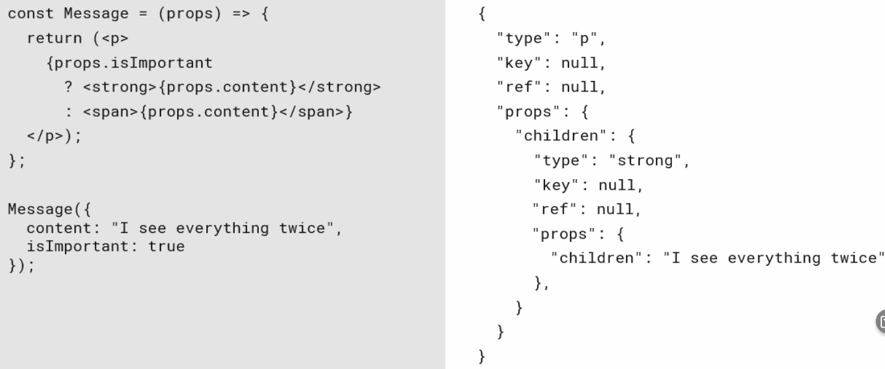

# Testing React
React is a frontend library, therefore it is difficult to pinpoint specific areas to test in a React application. Most logic to be tested is usually in the backend which then only provides React with data. It is essential to decide on what is and what is not suitable for testing.

## Tip for Components
If we are using a library like Redux we might encounter a problem where we are not able to test a component without a Redux `Provider` because the component gets usually exported like this:

```tsx
const MyComponent: React.Component = () => {
  // ...
}

// connect() is a redux function that supplies redux' state to our component
export default connect(mapStateToProps, mapDispatchToProps)(MyComponent);
```

In this case we have two options:

1. Mock the required service our component depends on.
2. Return pure service for the sake of testing.

While solution 1 seems to be the correct solution, it can be time consuming or complex to achieve. If we need to use the solution 2, we can just rename our component and `export` it via named export:

```tsx
const MyComponent: React.Component = () => {
  // ...
}

// connect() is a redux function that supplies redux' state to our component
export default connect(mapStateToProps, mapDispatchToProps)(MyComponent);
export const MyPureComponent = MyComponent;
```

It is up to us to decide on how the component should be named. I wouldn't advise using the same name for export because we can get cryptic errors when accidentally mixing the imports up:

```tsx
// Export the component
export const MyComponent: React.Component = () => {
  // ...
}
// as well as the dependant version of it
export default connect(mapStateToProps, mapDispatchToProps)(MyComponent);


// somewhere.tsx
import { MyComponent } from 'confusion/MyComponent';

// ... wait, what happened, why does it not work ?
```

# Tools
There may be many tools that are available for us to use. We need to supply a testing framework. React provides [testing API](https://reactjs.org/docs/testing.html) which handles access to components - children, props, etc. We can see the mapping in the following figure.



There are many tools like [Jest](https://jestjs.io/), [mocha](https://mochajs.org/), [ava](https://github.com/avajs/ava) or [enzyme](https://enzymejs.github.io/enzyme/). React also has it's own utilities for testing called [test utils](https://reactjs.org/docs/test-utils.html) and a [test renderer](https://reactjs.org/docs/test-renderer.html) which renders hierarchical structure as pure javascript objects (similar to DOM). [React testing library](https://testing-library.com/docs/react-testing-library/intro) is a flexible alternative even for non-react projects. 

We could also consider other tools like [Storybook](https://storybook.js.org/) which are not necessarily designed for testing but offer great flexibility and allow us to isolate components in such way we can inspect them (much like exploratory testing).

Using these libraries can be sometimes confusing and even the names are sometimes similar. We can view it like this:

- `Jest` is a test runner. It lets us create and run tests and works with many other testing libraries. It is the testing environment.
- `mocha`, `enzyme`, `react testing library` or `test utils` let us somehow instantiate and access components[^2] and therefore enable test evaluation (without them we wouldn't have anything to test).
  - `react testing library` focuses on what the user sees. It has a `render` function which creates an instance on which we can search for visual elements like texts, titles, alt-texts, placeholders and others. It deviates from the usage of IDs, HTML types and such, because it tries to avoid implementation details.
  - React's `test-renderer` is just a rendering tool which simulates rendering (not the actual DOM). Working with it feels like using a dynamic React execution environment where we can render, mount/unmount and query components based on their types, props, parent, children, etc.
  - `enzyme` is similar to `react testing library` and offers different types of render functions (a shallow or a full render). It let's us locate elements with the JQuery style search functions (`find('h1')`, `find('#root')`, `find('.link')`).
  
[^2]: The differences make the advantages and disadvantages of each tool.

## StoryBook
Visual tool that helps us create a toolbox of our React components. It allows us to render components in isolation with different default values and attributes. We then access Storybook and manually verify the rendered components and intended interaction.

## Jest
Library that let's us execute test code - so called 'test runner'. It can rely on the document content and test for different aspects of it, like 'Does it contain certain text ?'.
Jest expects files to have an ending of `.test.js` (or other appropriate extensions like `ts` or `tsx` etc.).

Writing tests consists of multiple steps. We need to keep good testing principles:
- Tests should not contain implementation details. Changes in implementation shouldn't require tests changes.
- We should test as specifically as possible. If our test fails, we should know exactly why and we shouldn't search for possible reason [^1].
- Never test through UI if it's avoidable. Testing functionality without the need of a complex UI approach is always more beneficial and allows us to focus on the logic instead of the interaction AND logic.
- Never test the same thing more than once.

Jest offers multiple convenient functions to ensure validity of results. Common is the `describe` function, usually used to introduce test methods. Test methods are named `it` but can also be named `test` with the same exact signature and meaning. These functions offer a placeholder for as many tests as needed (keep in mind good test practices). Often we would use a function like [expect](https://jestjs.io/docs/expect) in order to evaluate an object. `expect` accepts a tested object as parameter and provides its evaluation. We can see sample usage in the following example:

```js
test('sample evaluation test', () => {
  expect(obj).toBe('ACAB - All Cats Are Beautiful');
  expect(container).toBeDefined();
  expect(resolution).toBeGreaterThanOrEqual(600);
});
```

# Writing tests
We can use different methods to write a test. Within React itself we have access to testing APIs. The basic API is [React Testing Library](https://testing-library.com/docs/react-testing-library/intro) which accesses components more like objects. According to different frontend features we might split testing into these sections:
- render tests: Check if component and its parts renders correctly with different props, values, etc.
- events: test if component catches events and responds accordingly.


## Render Tests
In this section we will look at the render tets using `Jest` and `React Testing Library`. First we look at the most basic example of function component `ErrorPage` 'rendered' via direct invocation:

```ts
import ErrorPage from "../../globalErrorHandling/ErrorPage";

describe('Error Page', () => {
  it('should display exact error message', () => {
    // define mock page with a test message
    const testErrorMessage = 'test error message';
    const errorPage = ErrorPage({
      errorMessage: testErrorMessage
    });

    expect(errorPage).toBeDefined();
    // access exact part of the HTML via children and props
    expect(errorPage?.props.children[0].props.children).toBe(testErrorMessage);
  })
})
```

Another and more feasible option to render is React's `Test Renderer`. It resembles the component hierarchy with a little more of React's abstractions like components and `props`. The environment `Test Renderer` runs in acts more like a browser, so it's more suitable than pure function invocation:

```ts
it('to have correct default option selected on render', () => {
    act(() => {
      createRoot(container)
        .render(<Select options={options} />)
    });
    const select = container.querySelector('select');
    expect(select?.value).toBe(options[0]);
  });
```

Note that Test Renderer has some convenient functions that **wrap some of the logic we've seen** in previous example(s) and thus it's not always required to use, for example, the `act` function. Another important point is that the `act` function from test renderer [behaves the same](https://reactjs.org/docs/test-utils.html#act) as the `act` function from react test utils.

The **key difference is** that React Testing Libraries renders to DOM Nodes and Test Renderer renders to React Components.

### Access to the rendered content
As we've seen above, different ways of rendering the UI might result in a different need of access. Plain function invocation (creating component by instantiating it) allows us to access `props` and `children`.

Test Renderer creates and uses `ReactTestInstance` which is similar to components with a few convenient functions to access elements. Below we see sample set of these showcased in dummy code:

```tsx
const {root } = create(<App />);
root.find((testInstance: ReactTestInstance) => {
  return !!testInstance.props?.checked;
});
root.children[0].toString()
root.findByType(FormLabel).children.length;
```

The ultimate access to the DOM happens via `render` function and its adaptations in testing tools. This should (as already mentioned) simulate browser environment and we get lots of `get...()`, `find...()` and `query...()` available to us. This is the most flexible option in my opinion, since we can search for text practically anywhere in the document.

```tsx
const root = render(<App />);
console.log(root.debug());

root.queryAllByAltText('alt-text')
root.getByLabelText('label text');
root.findAllByTitle(/Title \d+/);
```

Notice that in the example above we use the a `root.debug()` which is a utility function that prints the HTML concent of the rendered variable. It's kinda neat for debugging if we're expecting values in testing but are not able to get them via the aforementioned methods. Exact definitions of each type of function can be found in [the official documentation](https://testing-library.com/docs/queries/about#types-of-queries):

- `getBy...()`: Returns the matching node for a query, and throw a descriptive error if no elements match or if more than one match is found (use getAllBy instead if more than one element is expected).
- `queryBy...()`: Returns the matching node for a query, and return null if no elements match. This is useful for asserting an element that is not present. Throws an error if more than one match is found (use queryAllBy instead if this is OK).
- `findBy...()`: Returns a Promise which resolves when an element is found which matches the given query. The promise is rejected if no element is found or if more than one element is found after a default timeout of 1000ms. If you need to find more than one element, use findAllBy.

Each function has specific twerks, for example if we decide to use `getBy...` we don't have to `expect` a result because the test will fail anyways if the `getBy...` function fails.

### Screen for the win
React testing library offers an amazing tool that enables us to access the DOM as describe in the most latter part of the last section. This is thanks to the `screen` component which also happens [to be recommended for use](https://testing-library.com/docs/queries/about#using-queries).

```tsx
import { screen } from '@testing-library/react';
// other imports...

test('app not crashing on start', async () => {
 await act(() => {
    createRoot(container).render(
      <MockedProvider>
        <App />
      </MockedProvider>
    )
  })

  // screen for the win 🏆
  expect(screen.queryByText('Home')).toBeTruthy();
});
```

Nevertheless, we have to be careful about the functions we use when rendering, since `render` is a common word within the React environment. Using the `render` function from React Testing Library we immediately obtain an object that is capable of using functions we otherwise tried to obtain from the `screen`:

```tsx
import { render, screen } from '@testing-library/react';
import App from '../app/App';

it('should render title on start', () => {
  const root = render(<App />);
  expect(screen.findByText(/administration/i)).toBeDefined();
});
```

[^1]: If our test checks whether user specified correct input OR the input has appropriate label, test failure wouldn't reveal the problem right away. On the other hand having test for input correctness will immediately reveal that the input is incorrect if the test failed.

### Helper functions

There are some tools in the React Testing Library that make our life easier, just like the `screen` tool. `logRoles` is one of them. It let's us see all the roles associated with a given element. Rendering the element and grabbing its `baseElement` we can see the associated roles:

```tsx
import { logRoles } from '@testing-library/dom';

const root = render(<App />);
logRoles(root.baseElement);

```

## Testing Events
Events can be tested on prop functions passed to the component. We need to use mocks to be able to detect any invocations, argument parsing, return value validation and others. Therefore we will use Jets' `jest.fn()`. We can supply default implementation to this `fn` function or even hard-code values that the function will return:

```js
const fn  = jest.fn();
const fn1 = jest.fn((a, b) => a + b);

// hardcode return value for one invocation
const fn2 = jest.fn();
fn2.mockReturnValueOnce(12);

// all invocations will return this value
const fn3 = jest.fn();
fn3.mockReturnValue(123);
```

We can then access the mock and review its arguments, return values, and other properties via the `mock` attribute.

```js
const fn = jest.fn((a,b) => a + b);
expect(fn(4,8)).toEqual(12);
// received arguments
expect(fn.mock.calls).toEqual([
  [1,2]
])
// return value(s)
expect(fn.mock.results).toEqual([
  {
    type: 'return',
    value: 12
  }
])
```

It is possible but cumbersome to test events with Test Renderer. It provides no direct API for events but we can access props and invoke prop function this way.

## Asynchronous Tests
Asynchronous tests are similar to synchronous with the exception that they must always return a promise. The caveat here is that if we forget to return the promise, **the test will always pass**. Therefore it is important to see our test fail, not only succeed.

If we don't want to return a promise, we need to make our test function `async` and `await` the promise. Jest provides a convenient function that doesn't required us to use the `then` chaining and we can use `expect()` evaluations nicely like this:

```ts
it('should perform async test', async () => {
  //                                 👇 notice the `resolves` keyword
  await expect(Promise.resolve(1+1)).resolves.toBe(2)
})
```

Another method to write asynchronous tests is to use the `waitFor()` function. In case we are testing user action (like button click for example) the test will fail, because firing the click event doesn't mean that it is performed immediately and therefore the test will still compare the old value. Here is how we would use the `waitFor` function:

```ts
import { render, fireEvent, waitFor } from '@testing-library/react';
//... other imports

test("cat should be selected after clicking on cat banner", async () => {
  const catBannerRegex = /cat-banner-(\w+)/;
  const catSelection = render(<CatSelector cats={allInactiveCats} />);
  const catBannerElements = catSelection.queryAllByTestId(catBannerRegex);

  catBannerElements.forEach(async (element) => {
    const catName = element.getAttribute('data-testid')?.match(catBannerRegex)?.at(1);
    fireEvent.click(element);
    const inputElement = catSelection.getByTestId('selected-cat-' + catName) as HTMLInputElement;

    await waitFor(() => expect(inputElement.checked).toBe(true));
  });
});
```

This test is not ideal, because it relies on the implementation a little (expecting specific test-ids). But we can see the `forEach` loop we click each cat banner element (whatever actual HTML element it might be) but without waiting for the click to happen we wouldn't be able to ensure that respective checkbox input element is really checked. Therefore we `await` for the promise created by `waitFor`.

Below we see a similar test but this time using Test Renderer and accessing props to invoke event handling function.

```ts
test("clicking a catBanner should reverse cats 'selected' value", () => {
  const catToRender = { ...cats[0], selected: false };
  const fn = jest.fn((catToRender: Cat) => {
    catToRender.selected = !catToRender.selected
    return catToRender.selected;
  });

  const { root } = create(<CatBanner cat={catToRender} onChange={fn} />);

  act(() => {
    root.props.onChange(catToRender);
    root.props.onChange(catToRender);
    root.props.onChange(catToRender);
  });

  expect(fn.mock.calls.length).toBe(3);
  expect(fn.mock.results).toEqual([
    {
      type: 'return',
      value: true
    }, {
      type: 'return',
      value: false
    }, {
      type: 'return',
      value: true
    },
  ])
})
```

## Mocks
Mocks are vicarious entities that replace actual values in our application when running in test environments. We are able to create them manually or let tools like Jest to crate them for us. They can be instantiated with random values, default values or undefined. They can also be configured after initialisation if necessary.

### Mocking Apollo Client
Apollo client instantiates and manages an `ApolloProvider`. This provider can be mocked to restrict the tests from accessing real APIs and services. A default Apollo mock can be created with `MockedProvider` without any schema mocks supplied:

```tsx
test('is not crashing on start', async () => {
  await act(() => {
    createRoot(container).render(
      <MockedProvider>
        <App />
      </MockedProvider>
    )
  });

  expect(screen.queryByText('Home')).toBeTruthy();
});
```

We can manipulate the Apollo communication using mocks and supply errors if we desire so. Notice in the next example that we supply the query that results in an error and we expect our application to act accordingly. This behaviour takes some time, so we wait for the `act()` promise to resolve and then we try to target the error message:

```tsx
test('should display error when server is not accessible', async () => {
    const mocks: MockedResponse = {
      request: {
        query: CheckConnectionDocument                // make this request fail
      },
      result: {
        errors: [new GraphQLError('expected error')]  // with following error
      }
    };

    await act(() => {
      createRoot(container).render(
        <MockedProvider mocks={[mocks]}>
          <App />
        </MockedProvider>
      )
    })

    expect(screen.queryByText('Server is not accessible')).toBeTruthy();
  });
```

### Mocking Services
In order to achieve proper service testing we have 2 options: 
1. Use the service as is. This is slow and requires the service to be available at the time of testing.
2. Mock the service with test values. This is fast but requires us to supply testing data.

Using the second approach we arrive to a conclusion that it is necessary for us to write our code in a way it is possible to mock services. This is immediately visible if we do test-driven development. Otherwise we might be forced to adjust the code base to use services provided via props rather than using services directly.

Consider next example taken from [GraphQL Client application from this repo](../apollo-client--snowpack-react-typescript). 

```ts
const CreateAttendance: React.FC = () => {
  const { error, loading, data } = useAllFishAndFishingGroundsQuery();
  const [addAttendanceMutation] = useAddAttendanceMutation({
    // update statistics on each successful addition
    refetchQueries: [
      { query: AllStatisticsDocument },
    ]
  });

  // ...
}
```

The `CreateAttendance` component uses hooks that access the GraphQL server in order to obtain data. These hooks were generated from a tool and we are using them directly in the code. Therefore it is not possible to mock them without changing the code. We would need to abstract the hooks to a service and provide it to the component via props like this:

```ts
type GraphQLAttendanceService = {
  useAllFishAndFishingGroundsQuery: // ...
  useAddAttendanceMutation: // ....
}

type CreateAttendanceProps = {
  graphqlService: GraphQLAttendanceService
}

const CreateAttendance: React.FC<CreateAttendanceProps> = (props) => {
  const { error, loading, data } = props.graphqlService.useAllFishAndFishingGroundsQuery();
  const [addAttendanceMutation] = props.graphqlService.useAddAttendanceMutation({
    // update statistics on each successful addition
    refetchQueries: [
      { query: AllStatisticsDocument },
    ]
  });

  // ...
```

Now we are able to mock the props from the testing environment by supplying our component with seemingly GraphQL Service but we know that our service will only create static, manually created data for testing purposes. One disadvantage of this approach is that we have to mock every required props dependency. Luckily, tools like Jest are able to generate mock values so we don't have to. Thanks to this our workflow will look like this:

1. Extract necessary functions, object and others into props.
2. Create mock object using a testing tool.
3. Configure the behaviour of mocked object according to test requirements.
4. Create tested component with supplied mock.
5. Execute necessary tests.

## Handling expected errors
Libraries like React's `Test Renderer` provide us with an ability to get elements in the rendered tree using the `findBy...` functions. The pitfall here is that when the Test Renderer doesn't find the element we're looking for it throws an error. If not handled, our tests will fail even when we're expecting it with Jest: 
`expect(root.findByType(Label)).toBeNull()`

The proper way to handle it is to provide a callback into the expect function and that solves the problem: 
`expect(() => root.findByType(Label)).toThrowError()`

# Snapshots
When we execute tests, testing tools can keep track of the results and compare them together. These are called snapshots. They can be used inline or stored to a file. These files should be pushed to source control to create a baseline for tests run on other machines.

These tests should be deterministic for this exact reason. Having a tests that uses a randomly generated timestamp would result in failure 100% of the time. Therefore should our tests only cover cases which will give exact values on each run to ensure proper testing process.

Due to their nature, snapshots tend to be more like regression tests than regular tests and should be used sparingly. The ideal scenario is to use them on parts of the project which is not changing or is not meant to change for a long time.

Using snapshots can be seen in the following example:

```tsx
// using test renderer
test('test some snapshot', () => {
  const jsonTree = create(<MyComponent someProp={somePropMock} />).toJSON();
  expect(jsonTree).toMatchSnapshot();
})
```

First run never fails - there is no snapshot to compare with. It gets created and test passes. It should be stored as `__snapshots__/TestFileName.test.tsx.snap`.

# Common Errors

## Error: 'MyComponent' refers to a value...
Using typescript in tests is possible and we only have to name our test files with typescript extension. Although we can use plain `.ts` files as in direct component tree access (see [Writing Tests](#writing-tests)). We have to be careful to change the file extension to `.tsx` in case we have to use JSX because we would get weird errors like this:

```jsx
  // ...
  .render(<SomePage message={testMessage} />
```
> Error: 'SomePage' refers to a value, but is being used as a type here. Did you mean 'typeof SomePage'? 🤔❓

## The current testing environment is not configured to support act(…)
Act is a function that allows us to simulate browser environment from test environment. We can use it like a [HOF](../Javascript-notes.md#higher-order-functions-hof)) and supply it with render function. BUT - for this to work we must adjust the environment. Using `create-react-app` we have this `setupTests.ts` file where we put all the test-related configuration. Here we need to specify that we are going to use `act()`. Since we're using Typescript we also have to define the type of a global configuration object `globalThis`:

```ts
(globalThis as any).IS_REACT_ACT_ENVIRONMENT = true;
```

As said in [the documentation](https://reactjs.org/blog/2022/03/08/react-18-upgrade-guide.html#configuring-your-testing-environment), this tells React that we are running in a test environment. If we are not able or don't want to use a test setup file, we can just set this variable inside a test like so:


```ts
// Some.test.ts
beforeAll(() => {
  (globalThis as any).IS_REACT_ACT_ENVIRONMENT = true;
});
```

## Refs in testing
Refs are problematic when it comes to tests. React wrote about it in [the official docs](https://reactjs.org/blog/2016/11/16/react-v15.4.0.html#mocking-refs-for-snapshot-testing) and provided tool for mocking refs. It is sort-of impossible to initialize refs since no DOM is ever being rendered. That's why **the test below will fail.**

```ts
test('that click on checkbox toggles selected attribute', () => {
  const { root } = create(<CatSelector cats={cats} />);
  const catBanners = root.findAllByType(CatBanner);
  expect(catBanners.length).toEqual(cats.length);

  for (const banner of catBanners) {
    act(() => {
      const container = banner.findByType('ul');
      container.props.onClick();
    })

    // ❗will never be true, because useRef hook in CatBanner will always be null ❗
    expect(banner.props.cat.selected).toBeTruthy();
  }
});
```

## TypeError: Cannot read properties of undefined
When testing components we might encounter errors (as seen in the name of this section) without much useful information. For example, using Formik's `useField` hook inside a custom component would result in this:

> Test
```tsx
 test('input field displays along with a label', () => {
    const labelText = "testing label text";
    const { root } = TestRenderer.create(
        <InputField name="sample" aria-label={labelText} />
    );
 });
```

> Resulting error (displayed as javascript code):
```ts
 // TypeError: Cannot read properties of undefined (reading 'getFieldProps')
 
 const InputField: React.FC<InputFieldProps> = ({ size: _, inputSize, ...props }) => {
 
  const [field, { error }] = useField(props.name);
 //                                  ^
 // ...
 }
```

What does the error actually mean ? After checking that we didn't forget to pass required props we must assume that a third-party library function, component, hook or any other piece of code might have dependencies that are outside of our direct scope or even view. In this example above, `useField` needs `getFieldProps` which is supplied by the **Formik context**, which resides in `<Formik>` component. Therefore it was a mistake to test the `InputField` outside of the `Formik` container, so we need to correct our mistake:

```tsx
 test('input field displays along with a label', () => {
    const labelText = "testing label text";
    const { root } = TestRenderer.create(
      <Formik onSubmit={() => { }} initialValues={{ sample: "" }}>
        <InputField name="sample" aria-label={labelText} />
      </Formik>
    );
 });
```


## Security Vulnerabilities in Test Renderer
Installing test renderer via `npm i --save-dev react-test-renderer` led to security vulnerabilities:

> 6 high severity vulnerabilities

I tried audit fix (`npm audit fix --force)` which broke the build even more, tried reinstalling dependencies but couldn't get rid of it. I will ignore it for now, since this is a sample project but it is nice to be aware. It is important to note that this might be only relevant to this testing project, because when I tried it in the `apollo-client--snowpack-react-typescript` project, no vulnerabilities were present.

TODO:
✅ https://app.pluralsight.com/course-player?clipId=b275895a-fbf0-4767-92f7-b32fb0959ea9
✅ https://app.pluralsight.com/course-player?clipId=924ba3c5-5261-4ac7-b6f5-e43157c986df
✅ https://app.pluralsight.com/library/courses/apollo-testing/table-of-contents

✅ https://app.pluralsight.com/library/courses/react-practical-start/table-of-contents
https://app.pluralsight.com/paths/skill/building-web-applications-with-react